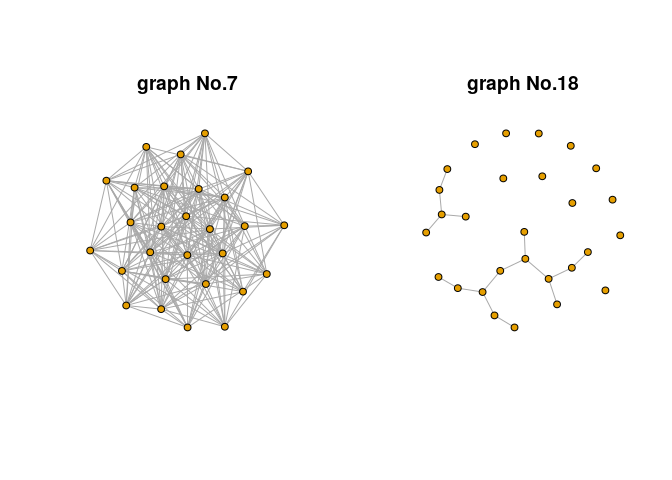
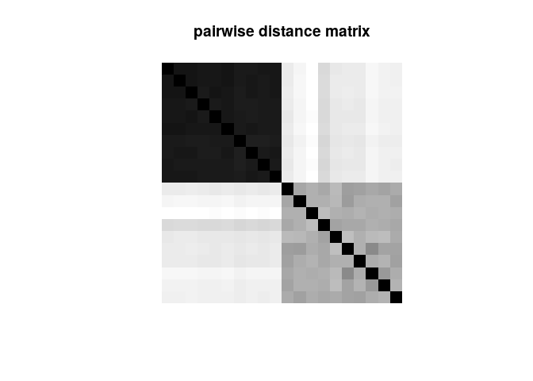
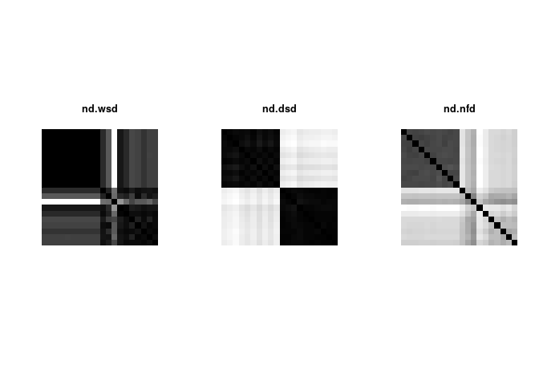

<!-- README.md is generated from README.Rmd. Please edit that file -->
NetworkDistance
===============

[](https://cran.r-project.org/package=NetworkDistance) [](https://travis-ci.org/kisungyou/NetworkDistance) [](https://cran.r-project.org/package=NetworkDistance)

NetworkDistance package is a collection of *inter-*, *between-*graph distance measures. Instead of graph distance that measures the degree of farness between nodes within a graph, we consider each network as an object and compute distance between those objects.

Installation
------------

You can install the released version of NetworkDistance from [CRAN](https://CRAN.R-project.org) with:

``` r
install.packages("NetworkDistance")
```

or the development version from github:

``` r
## install.packages("devtools")
devtools::install_github("kisungyou/NetworkDistance")
```

Usage
-----

Surely, the first thing we are always bound to do is to load the package,

``` r
library(NetworkDistance)
```

Suppose you have *N* network objects represented as square adjacency matrices. All the functions in the package require your data to be in a form of `list` whose elements are your adjacency matrices. Let's load example data `graph20`.

``` r
data(graph20)     # use `help(graph20)' to see more details.
typeof(graph20)   # needs to be a list
#> [1] "list"
```

Before proceeding any further, since we have two types of graphs - densely and sparsely connected with *p* = 0.8 and *p* = 0.2 - we know that the distance matrix should show block-like pattern. Below is two example graphs from the dataset.  Once you have your data in such a form, all you've got is to run a single-line code to acquire distance numerics, resulting in either a `dist` class object or a square matrix. For example, let's compute *graph diffusion distance* by Hammond et al. (2013) on our example set.

``` r
dist.gdd <- nd.gdd(graph20)  # return as a 'dist' object
```

and you can see the discriminating pattern from the distance matrix `dist.gdd$D` with black represents 0 and white represents the largest positive number, indicating large deviation from 0.  Finally, let's compare different methods as well.

``` r
dist.wsd <- nd.wsd(graph20)              # spectrum-weighted distance
dist.dsd <- nd.dsd(graph20, type="SLap") # discrete spectral measure
dist.nfd <- nd.nfd(graph20)              # network flow distance
```



Code of Conduct
---------------

Please note that the 'NetworkDistance' project is released with a [Contributor Code of Conduct](CODE_OF_CONDUCT.md). By contributing to this project, you agree to abide by its terms.
